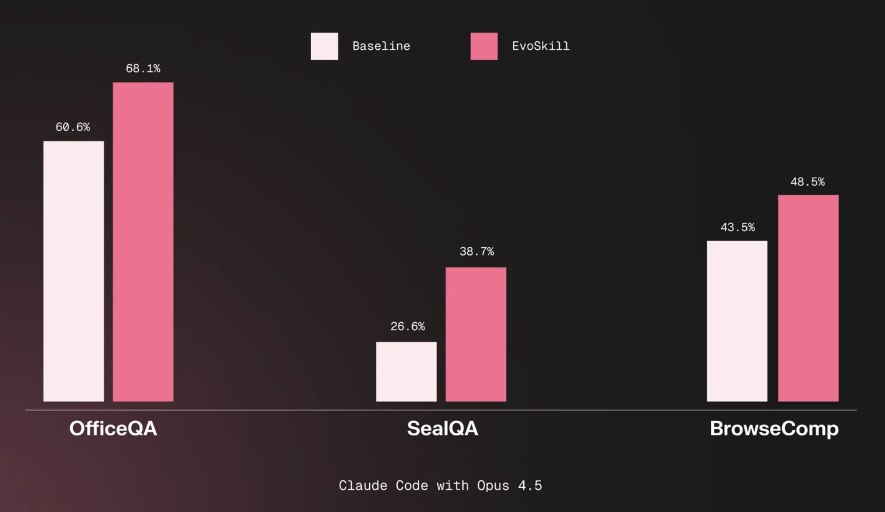
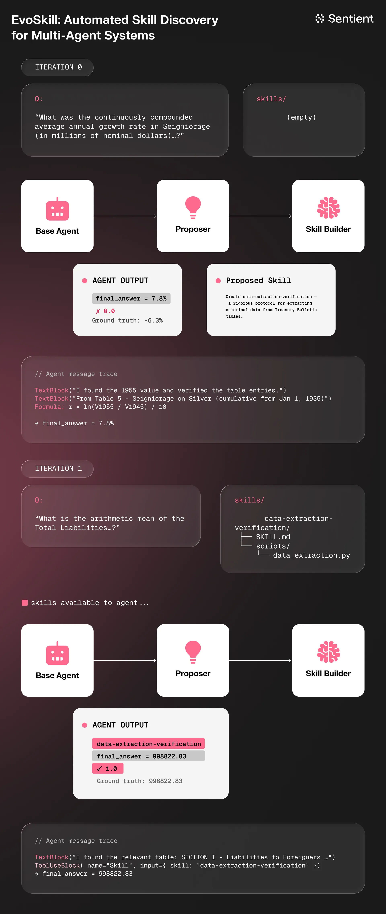

<div align="center">
    
    <br>
    <h1>EvoSkill: Automated Skill Discovery for Coding Agents</h1>
</div>


<p align="center">
  <a href="https://www.alphaxiv.org/abs/2603.02766"></a>
  <a href="https://www.sentient.xyz/blog/evoskill-automated-skill-induction-from-agent-failures"></a>
  <a href="https://sentient.xyz"></a>
  <a href="https://x.com/SentientAGI"> 
  <a href="https://github.com/sentient-agi/EvoSkill/blob/main/LICENSE"></a>
</p>

<b>Turn your general AI agents into state-of-the-art specialists with a benchmark and EvoSkill, a toolkit for automatically creating and improving AI skills, compatible with Claude Code, Codex CLI, OpenCode, OpenHands, Goose, and more.</b>

<b>EvoSkill</b> significantly extends the feedback-driven idea of <b>[GEPA](https://github.com/sentient-agi/gepa-plus)</b> from single-file optimization to complete agent evolution. Instead of only revising one prompt in place like GEPA, EvoSkill proposes multiple skill and prompt mutations jointly, evaluates new variants on held-out data, and has each iteration produce an entirely new agent program.

<p align="center">
  
</p>

Install in seconds, then run `evoskill init` and `evoskill run` to supercharge any coding agent with <b>AI-created skills and prompts</b> automatically. Depending on the agent, you are free to use <b>any model provider</b> of your choice ([OpenRouter](https://openrouter.ai/models?q=g), [Anthropic](https://platform.claude.com/docs/en/about-claude/models/overview), [OpenAI](https://platform.openai.com/), [Fireworks](https://fireworks.ai/), and more) and <b>any model</b> you want (Claude, GLM, Minimax, Kimi, GPT, Gemini, Qwen, and others).

Also join us on [Discord](https://discord.gg/sentientfoundation) to discuss your experience, share suggestions, or show off your work!

## 🤖 Supported agents

<table>
  <thead>
    <tr>
      <th>Agent</th>
      <th>Support</th>
      <th>Notes</th>
    </tr>
  </thead>
  <tbody>
    <tr>
      <td><a href="https://www.anthropic.com/claude-code">Claude Code</a></td>
      <td>✅</td>
      <td></td>
    </tr>
    <tr>
      <td><a href="https://opencode.ai/">OpenCode</a></td>
      <td>✅</td>
      <td>CLI v1.4.0+ required (structured output support)</td>
    </tr>
    <tr>
      <td><a href="https://github.com/OpenHands/OpenHands">OpenHands</a></td>
      <td>✅</td>
      <td>No native structured output; uses fallback JSON extraction</td>
    </tr>
    <tr>
      <td><a href="https://github.com/block/goose">Goose</a></td>
      <td>✅</td>
      <td>CLI v1.25.0+ required (skill discovery via summon extension)</td>
    </tr>
    <tr>
      <td><a href="https://openai.com/index/introducing-codex/">Codex CLI</a></td>
      <td>✅</td>
      <td>Skill discovery via .agents/skills/ symlink</td>
    </tr>
  </tbody>
</table>   

## 🎨 Features

<table>
  <thead>
    <tr>
      <th>Capability</th>
      <th>Status</th>
      <th>Explanation</th>
    </tr>
  </thead>
  <tbody>
    <tr>
      <td><b>Evolution with a benchmark</b></td>
      <td>✅</td>
      <td>
        Skills can be effectively improved against your own or academic benchmarks.
      </td>
    </tr>
    <tr>
      <td><b>Cross-agent transferability</b></td>
      <td>✅</td>
      <td>
        <a href="https://agentskills.io">Skills</a> are packaged as reusable folders with instructions, metadata, and helper scripts, compatible with many coding agents.
      </td>
    </tr>
    <tr>
      <td><b>Cross-model transferability</b></td>
      <td>✅</td>
      <td>
        Demonstrated in <a href="https://arxiv.org/html/2604.01687v1">EvoSkills</a>, skills evolved with a fixed LLM can transfer their performance increase to other LLMs.
      </td>
    </tr>
    <tr>
      <td><b>Cross-task transferability</b></td>
      <td>✅</td>
      <td>
        Generated skills can be generic enough to transfer across tasks, for instance a SealQA skill improving BrowseComp performance (as shown in <a href="https://arxiv.org/abs/2603.02766">EvoSkill</a>).
      </td>
    </tr>
    <tr>
      <td><b>Evolution without a benchmark</b></td>
      <td>🛠️</td>
      <td>
        An open research direction where benchmarks are generated on the fly (ex. <a href="https://github.com/NousResearch/hermes-agent-self-evolution">Hermes-Agent self-evolution</a>).
      </td>
    </tr>
    <tr>
      <td><b>Continuous evolution</b></td>
      <td>🛠️</td>
      <td>
        Integrating the ability to improve skills from regular usage.
      </td>
    </tr>
  </tbody>
</table>

## Table of Contents

- [Installation](#installation)
- [Quickstart](#quickstart)
- [CLI Reference](#cli-reference)
- [Configuration Reference](#configuration-reference)
- [How It Works](#how-it-works)
- [Git Branches](#git-branches)
- [When the Loop Gets Stuck](#when-the-loop-gets-stuck)
- [Python API](#python-api)
- [Citation](#citation)
- [License](#license)


## Installation

**Requirements:**
- Python 3.12+
- [`uv`](https://github.com/astral-sh/uv) (recommended) or `pip`

```bash
# Using uv (recommended)
uv sync

# Or using pip
pip install -e .
```

**Agent CLI (install whichever harness you plan to use):**

```bash
brew install --cask claude-code    # Claude Code
brew install opencode              # OpenCode (v1.4.0+)
brew install --cask codex          # Codex CLI
brew install block-goose-cli       # Goose (v1.25.0+)
```

**Common auth setup:**

```bash
# Anthropic (Claude Code harness)
export ANTHROPIC_API_KEY=your-key-here

# OpenAI (Codex harness)
export OPENAI_API_KEY=your-key-here

# OpenRouter (OpenCode / Goose / OpenHands harnesses)
export OPENROUTER_API_KEY=your-key-here
```

OpenRouter-backed evolution runs also accept `LLM_API_KEY`, but `OPENROUTER_API_KEY` is the preferred env var.

---

## Quickstart

### 1. Initialize a project

Run `evoskill init` inside any git repository:

```bash
$ evoskill init

  EvoSkill — Project Setup
  Which harness? › claude
  Evolution mode? › skill_only — agent learns new skills (recommended)
  Dataset path? › /absolute/path/to/questions.csv
  Question column name? › question
  Ground truth column name? › answer
  Category column name? (leave blank if none) ›
  Additional folders the agent can interact with? › /absolute/path/to/data_dir
```

This creates `.evoskill/config.toml` and `.evoskill/task.md`.

- **Dataset path** — absolute path to your CSV file containing questions and ground-truth answers.
- **Data dirs** — absolute paths to any additional directories the agent needs access to during runs (e.g. reference documents, databases). Comma-separated if multiple.

### 2. Describe your task

Edit `.evoskill/task.md` to describe what the agent should do:

```markdown
# Task

Answer questions about quarterly financial reports.
Return only the numeric answer with units.

## Examples
- "What was revenue in Q3?" → "$4.2B"

---

# Constraints
- Always include units in the answer
- Do not explain your reasoning, just return the answer
```

### 3. Run the loop

```bash
evoskill run
```

EvoSkill will run the evolutionary loop and print a live progress table:

```bash
  Iter  Accuracy  Δ          Skills  Frontier  Status
  1     42.0%     —          0       [1]       baseline
  2     51.3%     +9.3%      1       [1, 2]    ★ new best
  3     49.7%     -1.6%      1       [1, 2]    discarded
  ...
```

### 4. Evaluate and inspect

```bash
evoskill eval          # score the best program on the validation set
evoskill skills        # list all discovered skills
evoskill diff          # see what changed vs baseline
evoskill logs          # view past run history
```

### 5. Use the best program

After the loop finishes, the best program lives on a git branch:

```bash
git branch | grep program/     # list all program branches
git checkout program/iter-skill-3   # switch to the best one
```

From there you can inspect what the loop discovered:

```bash
cat .claude/program.yaml       # system prompt, tools, score
ls .claude/skills/             # all learned skills
```

Copy `.claude/program.yaml` and `.claude/skills/` into your deployment to use the evolved agent configuration.

## CLI Reference

| Command | Description |
|---------|-------------|
| `evoskill init` | Initialize a new project (creates `.evoskill/`) |
| `evoskill run` | Run the self-improvement loop |
| `evoskill eval` | Evaluate the best program on the validation set |
| `evoskill skills` | List all skills discovered so far |
| `evoskill diff` | Diff baseline vs best, or between two iterations |
| `evoskill logs` | Show recent run history |
| `evoskill reset` | Delete all program branches and start fresh |

### `evoskill run`

```bash
evoskill run [--continue] [--verbose] [--quiet]
```

| Flag | Description |
|------|-------------|
| `--continue` | Resume from the existing frontier instead of starting fresh. Preserves all `program/*` branches, `frontier/*` tags, feedback history, and the sampling checkpoint so the loop picks up exactly where it left off. |
| `--verbose` | Show per-sample pass/fail results |
| `--quiet` | Show the progress table only, suppress proposer output |

### `evoskill diff`

```bash
evoskill diff              # baseline → current best
evoskill diff 3 7          # iteration 3 vs iteration 7
```

The diff is scoped to the `.claude/` directory — it shows changes to skills and the system prompt, not your source code.

### `evoskill logs`

```bash
evoskill logs              # last 5 runs (default)
evoskill logs --last 10    # last 10 runs
```

### `evoskill reset`

```bash
evoskill reset             # prompts for confirmation
```

Deletes all `program/*` branches, `frontier/*` tags, the loop checkpoint, and feedback history. Your source code, `config.toml`, `task.md`, and any skills in `.claude/skills/` are left untouched.

## Configuration Reference

`evoskill init` creates `.evoskill/config.toml`. All fields are optional — defaults are shown below.

```toml
[harness]
name = "claude"        # "claude", "opencode", "codex", "goose", or "openhands"
model = "sonnet"       # Claude alias, Codex model name, or provider/model for OpenCode/Goose/OpenHands
data_dirs = ["/absolute/path/to/data_dir"]  # extra directories the agent can read

[evolution]
mode = "skill_only"          # "skill_only" or "prompt_only"
iterations = 20
frontier_size = 3
concurrency = 4
no_improvement_limit = 5

[dataset]
path = "/absolute/path/to/questions.csv"  # absolute path to the dataset CSV
question_column = "question"
ground_truth_column = "ground_truth"
category_column = ""         # optional, for stratified sampling
train_ratio = 0.18
val_ratio = 0.12

[scorer]
type = "multi_tolerance"     # see scorer types below
```

**Common evolution model setups:**

Anthropic:

```toml
[harness]
name = "claude"
model = "claude-sonnet-4-6"
```

OpenAI:

```toml
[harness]
name = "codex"
model = "gpt-5"
```

OpenRouter:

```toml
[harness]
name = "opencode"
model = "openrouter/openai/gpt-5-mini"
```

Notes:
- `claude` is Anthropic-only.
- `codex` uses bare OpenAI model names such as `gpt-5`, `o3`, or `codex-mini-latest`.
- `opencode`, `goose`, and `openhands` are multi-provider harnesses and can also use Claude and OpenAI models.
- `opencode`, `goose`, and `openhands` accept `provider/model` strings such as `anthropic/claude-sonnet-4-6`, `openai/gpt-5`, or `openrouter/openai/gpt-5-mini`.

### Scorer types

| Type | Description |
|------|-------------|
| `multi_tolerance` | Flexible string matching: exact, numeric tolerance, list overlap (default) |
| `exact` | Case-insensitive exact string match |
| `llm` | LLM-as-judge grading with a custom rubric |
| `script` | Shell script scorer — receives `{predicted}` and `{expected}` as variables |

**LLM scorer options:**

```toml
[scorer]
type = "llm"
rubric = "Award 1.0 if the answer is numerically correct within 5%, 0.0 otherwise."
model = "claude-sonnet-4-6"   # defaults to claude-sonnet-4-6
provider = "anthropic"        # "anthropic", "openai", "google", or "openrouter"
```

For OpenRouter-backed scoring, set `provider = "openrouter"` and use an OpenRouter model ID such as `openai/gpt-5-mini` or `google/gemini-2.5-flash`. Authentication uses `OPENROUTER_API_KEY` and falls back to `LLM_API_KEY` if needed.

**Script scorer options:**

```toml
[scorer]
type = "script"
command = "python score.py --predicted {predicted} --expected {expected}"
```

## How It Works

<p align="center">
  
</p>

The self-improvement loop follows five stages:

1. **Base Agent** — Attempts benchmark questions using the current best program (system prompt + skills).
2. **Proposer** — Analyzes failure cases and proposes targeted skill or prompt changes to address them.
3. **Generator** — Creates the proposed changes: writes new skill files or rewrites the system prompt.
4. **Evaluator** — Scores the new program variant on a held-out validation set to measure improvement.
5. **Frontier** — Tracks the top-N performing programs as git branches; the best survive to the next iteration.

This cycle repeats for a configurable number of iterations, automatically converging on stronger agent configurations.

## Git Branches

EvoSkill uses your repo's git history to version every program it creates. During a run it automatically creates and switches between branches — you don't need to do anything. After a run your branch layout will look like:

```
main                      ← your code, untouched
program/base              ← initial baseline agent
program/iter-skill-1      ← after iteration 1
program/iter-skill-2      ← after iteration 2
...
```

Frontier members are marked with `frontier/*` tags. EvoSkill only ever writes to branches prefixed `program/`, so there is no risk of it touching your working branch.

## When the Loop Gets Stuck

If accuracy stops improving, try the following:

1. **Check the feedback log** — `.claude/feedback_history.md` records what the proposer tried each iteration and why it succeeded or failed.
2. **Resume instead of restarting** — `evoskill run --continue` picks up from the last frontier rather than discarding progress.
3. **Reset and start fresh** — `evoskill reset` clears all branches and lets you start over with a revised `task.md`.

## Python API

For programmatic usage, EvoSkill exposes a high-level Python API.

### `EvoSkill`

```python
from src.api import EvoSkill

evo = EvoSkill(
    task="sealqa",
    model="sonnet",
    mode="skill_only",
    max_iterations=20,
    frontier_size=3,
    concurrency=4,
    train_ratio=0.18,
    val_ratio=0.12,
    continue_mode=False,
)
result = await evo.run()

# Synchronous usage
result = EvoSkill(task="base").run_sync()
```

### `EvalRunner`

```python
from src.api import EvalRunner

summary = await EvalRunner(
    task="sealqa",
    model="sonnet",
    max_concurrent=8,
).run()
```


## Citation

If you use EvoSkill in your research, please cite the [original paper](https://arxiv.org/abs/2603.02766):

```bibtex
@misc{alzubi2026evoskillautomatedskilldiscovery,
      title={EvoSkill: Automated Skill Discovery for Multi-Agent Systems}, 
      author={Salaheddin Alzubi and Noah Provenzano and Jaydon Bingham and Weiyuan Chen and Tu Vu},
      year={2026},
      eprint={2603.02766},
      archivePrefix={arXiv},
      primaryClass={cs.AI},
      url={https://arxiv.org/abs/2603.02766}, 
}
```

## License

This project is licensed under the Apache 2.0 License - see the [LICENSE](LICENSE) file for details.
