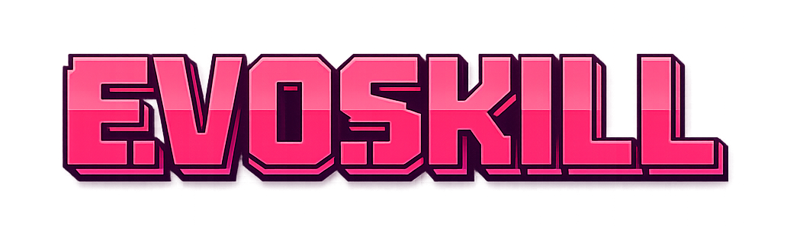

<div align="center">
    
    <h1>EvoSkill: Automated Skill Discovery for Coding Agents</h1>
</div>

<p align="center">
  <a href="https://www.alphaxiv.org/abs/2603.02766"></a>
  <a href="https://www.sentient.xyz/blog/evoskill-automated-skill-induction-from-agent-failures"></a>
  <a href="https://sentient.xyz"></a>
  <a href="https://x.com/SentientAGI"> 
  <a href="https://github.com/sentient-agi/EvoSkill/blob/main/LICENSE"></a>
</p>

<b>Supercharge your coding agents with EvoSkill, an agent-agnostic toolkit for automatically creating and improving AI skills, compatible with Claude Code, OpenCode, OpenHands, Goose, and more.</b>

<b>EvoSkill</b> uses <b>[GEPA](https://github.com/sentient-agi/gepa-plus)/[DSPy](https://github.com/stanfordnlp/dspy)-style self-improvement algorithms</b> that identify agent failure patterns, propose skill or prompt improvements, evaluate the changes, and keep the best-performing variants, similar to [<b>Karpathy's autoresearch</b>](https://github.com/karpathy/autoresearch).

<p align="center">
  
</p>

Install into <b>any coding agent</b> in seconds, and supercharge it with <b>AI-created skills</b> automatically. Depending on the agent, you are free to use <b>any model provider</b> of your choice ([OpenRouter](https://openrouter.ai/models?q=g), [Anthropic](https://platform.claude.com/docs/en/about-claude/models/overview), [OpenAI](https://platform.openai.com/), [Fireworks](https://fireworks.ai/), and more) and <b>any model</b> you want (Claude, GLM, Minimax, Kimi, GPT, Gemini, Qwen, and others).

## 🤖 Supported agents

<table>
  <thead>
    <tr>
      <th>Agent</th>
      <th>Support</th>
      <th>Notes</th>
    </tr>
  </thead>
  <tbody>
    <tr>
      <td><a href="https://www.anthropic.com/claude-code">Claude Code</a></td>
      <td>✅</td>
      <td></td>
    </tr>
    <tr>
      <td><a href="https://opencode.ai/">OpenCode</a></td>
      <td>✅</td>
      <td>CLI v1.4.0+ required (structured output support)</td>
    </tr>
    <tr>
      <td><a href="https://github.com/OpenHands/OpenHands">OpenHands</a></td>
      <td>✅</td>
      <td></td>
    </tr>
    <tr>
      <td><a href="https://github.com/block/goose">Goose</a></td>
      <td>✅</td>
      <td>CLI v1.25.0+ required (skill discovery via summon extension)</td>
    </tr>
    <tr>
      <td><a href="https://openai.com/index/introducing-codex/">Codex CLI</a></td>
      <td>✅</td>
      <td>Skill discovery via .agents/skills/ symlink</td>
    </tr>
  </tbody>
</table>   

## 🎨 Features

<table>
  <thead>
    <tr>
      <th>Capability</th>
      <th>Status</th>
      <th>Explanation</th>
    </tr>
  </thead>
  <tbody>
    <tr>
      <td><b>Evolution with a benchmark</b></td>
      <td>✅</td>
      <td>
        Skills can be effectively improved against your own or academic benchmarks.
      </td>
    </tr>
    <tr>
      <td><b>Cross-agent transferability</b></td>
      <td>✅</td>
      <td>
        <a href="https://agentskills.io">Skills</a> are packaged as reusable folders with instructions, metadata, and helper scripts, compatible with many coding agents.
      </td>
    </tr>
    <tr>
      <td><b>Cross-model transferability</b></td>
      <td>✅</td>
      <td>
        Demonstrated in <a href="https://arxiv.org/html/2604.01687v1">EvoSkills</a>, skills evolved with a fixed LLM can transfer their performance increase to other LLMs.
      </td>
    </tr>
    <tr>
      <td><b>Cross-task transferability</b></td>
      <td>✅</td>
      <td>
        Generated skills can be generic enough to transfer across tasks, for instance a SealQA skill improving BrowseComp performance (as shown in <a href="https://arxiv.org/abs/2603.02766">EvoSkill</a>).
      </td>
    </tr>
    <tr>
      <td><b>Evolution without a benchmark</b></td>
      <td>🛠️</td>
      <td>
        An open research direction where benchmarks are generated on the fly (ex. <a href="https://github.com/NousResearch/hermes-agent-self-evolution">Hermes-Agent self-evolution</a>).
      </td>
    </tr>
    <tr>
      <td><b>Continuous evolution</b></td>
      <td>🛠️</td>
      <td>
        Integrating the ability to improve skills from regular usage.
      </td>
    </tr>
  </tbody>
</table>

## Table of Contents

- [Installation](#installation)
- [Quickstart](#quickstart)
- [CLI Reference](#cli-reference)
- [Configuration Reference](#configuration-reference)
- [Running Experiments Directly with `scripts/run_loop.py`](#running-experiments-directly-with-scriptsrun_looppy)
- [Phoenix Observability](#phoenix-observability)
- [Dataset Utilities](#dataset-utilities)
- [How It Works](#how-it-works)
- [Git Branches](#git-branches)
- [When the Loop Gets Stuck](#when-the-loop-gets-stuck)
- [Python API](#python-api)
- [Citation](#citation)
- [License](#license)


## Installation

**Requirements:**
- Python 3.12+
- [`uv`](https://github.com/astral-sh/uv) (recommended) or `pip`

```bash
# Using uv (recommended)
uv sync

# Or using pip
pip install -e .
```

**API key:**

```bash
export ANTHROPIC_API_KEY=your-key-here
```

---

## Quickstart

### 1. Initialize a project

Run `evoskill init` inside any git repository:

```bash
$ evoskill init

  EvoSkill — Project Setup
  Which harness? › claude
  Evolution mode? › skill_only — agent learns new skills (recommended)
  Dataset path? › ./data/questions.csv
  Question column name? › question
  Ground truth column name? › answer
  Category column name? (leave blank if none) ›
```

This creates `.evoskill/config.toml` and `.evoskill/task.md`.

### 2. Describe your task

Edit `.evoskill/task.md` to describe what the agent should do:

```markdown
# Task

Answer questions about quarterly financial reports.
Return only the numeric answer with units.

## Examples
- "What was revenue in Q3?" → "$4.2B"

---

# Constraints
- Always include units in the answer
- Do not explain your reasoning, just return the answer
```

### 3. Run the loop

```bash
evoskill run
```

EvoSkill will run the evolutionary loop and print a live progress table:

```bash
  Iter  Accuracy  Δ          Skills  Frontier  Status
  1     42.0%     —          0       [1]       baseline
  2     51.3%     +9.3%      1       [1, 2]    ★ new best
  3     49.7%     -1.6%      1       [1, 2]    discarded
  ...
```

### 4. Evaluate and inspect

```bash
evoskill eval          # score the best program on the validation set
evoskill skills        # list all discovered skills
evoskill diff          # see what changed vs baseline
evoskill logs          # view past run history
```

### 5. Use the best program

After the loop finishes, the best program lives on a git branch:

```bash
git branch | grep program/     # list all program branches
git checkout program/iter-skill-3   # switch to the best one
```

From there you can inspect what the loop discovered:

```bash
cat .claude/program.yaml       # system prompt, tools, score
ls .claude/skills/             # all learned skills
```

Copy `.claude/program.yaml` and `.claude/skills/` into your deployment to use the evolved agent configuration.

## CLI Reference

| Command | Description |
|---------|-------------|
| `evoskill init` | Initialize a new project (creates `.evoskill/`) |
| `evoskill run` | Run the self-improvement loop |
| `evoskill eval` | Evaluate the best program on the validation set |
| `evoskill skills` | List all skills discovered so far |
| `evoskill diff` | Diff baseline vs best, or between two iterations |
| `evoskill logs` | Show recent run history |
| `evoskill reset` | Delete all program branches and start fresh |

### `evoskill run`

```bash
evoskill run [--continue] [--verbose] [--quiet]
```

| Flag | Description |
|------|-------------|
| `--continue` | Resume from the existing frontier instead of starting fresh. Preserves all `program/*` branches, `frontier/*` tags, feedback history, and the sampling checkpoint so the loop picks up exactly where it left off. |
| `--verbose` | Show per-sample pass/fail results |
| `--quiet` | Show the progress table only, suppress proposer output |

### `evoskill diff`

```bash
evoskill diff              # baseline → current best
evoskill diff 3 7          # iteration 3 vs iteration 7
```

The diff is scoped to the `.claude/` directory — it shows changes to skills and the system prompt, not your source code.

### `evoskill logs`

```bash
evoskill logs              # last 5 runs (default)
evoskill logs --last 10    # last 10 runs
```

### `evoskill reset`

```bash
evoskill reset             # prompts for confirmation
```

Deletes all `program/*` branches, `frontier/*` tags, the loop checkpoint, and feedback history. Your source code, `config.toml`, `task.md`, and any skills in `.claude/skills/` are left untouched.

## Configuration Reference

`evoskill init` creates `.evoskill/config.toml`. All fields are optional — defaults are shown below.

```toml
[harness]
name = "claude"        # "claude" or "opencode"
model = "sonnet"       # model alias or full model ID (e.g. "claude-sonnet-4-6")
data_dirs = []         # extra directories the agent can read

[evolution]
mode = "skill_only"          # "skill_only" or "prompt_only"
iterations = 20
frontier_size = 3
concurrency = 4
no_improvement_limit = 5

[dataset]
path = "data/questions.csv"  # relative to .evoskill/, or absolute
question_column = "question"
ground_truth_column = "ground_truth"
category_column = ""         # optional, for stratified sampling
train_ratio = 0.18
val_ratio = 0.12

[scorer]
type = "multi_tolerance"     # see scorer types below
```

### Scorer types

| Type | Description |
|------|-------------|
| `multi_tolerance` | Flexible string matching: exact, numeric tolerance, list overlap (default) |
| `exact` | Case-insensitive exact string match |
| `llm` | LLM-as-judge grading with a custom rubric |
| `script` | Shell script scorer — receives `{predicted}` and `{expected}` as variables |

**LLM scorer options:**

```toml
[scorer]
type = "llm"
rubric = "Award 1.0 if the answer is numerically correct within 5%, 0.0 otherwise."
model = "claude-sonnet-4-6"   # defaults to claude-sonnet-4-6
provider = "anthropic"        # "anthropic", "openai", or "google"
```

**Script scorer options:**

```toml
[scorer]
type = "script"
command = "python score.py --predicted {predicted} --expected {expected}"
```

## Running Experiments Directly with `scripts/run_loop.py`

`evoskill run` is a friendly wrapper, but for benchmark experiments you'll typically launch the loop directly. `scripts/run_loop.py` exposes every knob and is what the EvoSkill team uses internally.

### Minimal launch

```bash
PYTHONPATH=. python scripts/run_loop.py \
  --train_dataset path/to/train.csv \
  --val_dataset path/to/val.csv \
  --max_iterations 4 \
  --concurrency 8 \
  --model sonnet
```

CSVs require the columns `uid, question, ground_truth, category` (the `category` field can be a single constant like `"all"` if you don't need stratified sampling).

### Full launch — production setup we use for OfficeQA

```bash
LOG=logs/evo-$(date +%Y%m%d-%H%M%S).log

set -a && source /path/to/.env && set +a && \
cd /path/to/EvoSkill && \
env -u CLAUDECODE -u CLAUDE_CODE_ENTRYPOINT -u CLAUDE_CODE_EXECPATH \
  PYTHONPATH=. \
  PYTHONUNBUFFERED=1 \
  ANTHROPIC_API_KEY="$ANTHROPIC_API_KEY" \
  nohup .venv/bin/python -u scripts/run_loop.py \
    --model sonnet \
    --evolver_model opus \
    --base_thinking adaptive \
    --base_effort medium \
    --evolver_thinking adaptive \
    --evolver_effort high \
    --max_iterations 4 \
    --failure_samples 1 \
    --samples_per_category 3 \
    --concurrency 15 \
    --reviewer_enabled false \
    --train_dataset .dataset/baby_train.csv \
    --val_dataset .dataset/baby_val.csv \
    --data_root /path/to/dataset/root \
    --workspace /path/to/separate-workspace-repo \
    --fresh true \
    >"$LOG" 2>&1 &

echo "PID: $!  |  Log: $LOG"
```

A few notes on this incantation:

- **`env -u CLAUDECODE -u CLAUDE_CODE_ENTRYPOINT -u CLAUDE_CODE_EXECPATH`** — strips Claude Code env vars when you launch from inside another Claude Code session. Without this, the nested Claude Agent SDK refuses to spawn.
- **`set -a && source .env && set +a`** then explicitly re-pass `ANTHROPIC_API_KEY` — the `env -u` wipe drops the inherited key; the judge LLM uses the raw Anthropic SDK and needs it back.
- **`nohup … &`** — detach so the run survives terminal hangups. Tail the log file in a second terminal.
- **`PYTHONUNBUFFERED=1` + `python -u`** — without these, the loop's stdout buffers and the log shows nothing for minutes.

### Key flags

| Flag | Default | Meaning |
|------|---------|---------|
| `--model` | None | Base agent model (alias `sonnet` / `opus` / `haiku`, or full ID `claude-sonnet-4-6`) |
| `--evolver_model` | `opus` | Model for the evolver / proposer / generator agents |
| `--base_thinking` | None | Thinking config for base agent: `adaptive` / `enabled` / `disabled` |
| `--base_effort` | None | Effort tier for base: `low` / `medium` / `high` / `max` |
| `--evolver_thinking` | None | Same options for the evolver |
| `--evolver_effort` | None | Same options for the evolver |
| `--max_iterations` | 20 | Number of improvement iterations |
| `--frontier_size` | 3 | Top-N programs to keep |
| `--no_improvement_limit` | 5 | Early-stop after N iterations without improvement |
| `--concurrency` | 4 | Parallel agent runs during evaluation |
| `--failure_samples` | 3 | Categories sampled per iter |
| `--samples_per_category` | 2 | Train samples per category per iter (total per-iter train = `failure_samples × samples_per_category`) |
| `--reviewer_enabled` | true | Background Haiku reviewer that extracts insights from successful iterations. Disable to keep budget tight. |
| `--train_dataset` | (auto-split) | Pre-split train CSV. Must be paired with `--val_dataset`. |
| `--val_dataset` | (auto-split) | Pre-split val CSV. |
| `--dataset` | `.dataset/new_runs_base/solved_dataset.csv` | Single-file dataset for auto-split (used only when `--train_dataset` / `--val_dataset` are not set) |
| `--data_root` | None | Extra data directory mounted into the agent's `add_dirs` (e.g., `/path/to/pdf/corpus`) |
| `--workspace` | `~/dev/evoskill-workspace` | Separate git repo for `program/*` branches and frontier state. Set to empty string to fall back to project root. |
| `--fresh` | false | Wipe all program branches, frontier tags, feedback, checkpoint, and workspace traces before running. **Does NOT wipe `<project>/.cache/runs/`** (the inference cache). |
| `--continue_loop` | false | Resume from existing frontier instead of starting fresh. Mutually exclusive with `--fresh`. |
| `--cache` | true | Enable run-cache reuse across launches. |
| `--accuracy_threshold` | None | Switch from accuracy → efficiency optimization once val accuracy crosses this (e.g., 0.8). |

### Inference cache reuse across `--fresh` runs

Inference traces are cached at `<project_root>/.cache/runs/<tree_hash>/`. The cache key includes:

- The workspace's git tree SHA (root + `.claude/skills/` tree)
- File-content hash of `.claude/skills/`
- Hash of the agent prompt files

Two runs with **identical content** will hit the cache and skip the inference. `--fresh true` deliberately preserves this cache so re-running on the same dataset doesn't re-pay base-eval cost. To force a full miss, use `--cache false` or `rm -rf .cache/runs/`.

### Workspace separation

For experiments on the EvoSkill repo itself (vs experiments downstream of it), pass `--workspace /path/to/separate/repo`. The workspace holds all evolutionary artifacts (`program/*` branches, `frontier/*` tags, feedback history, checkpoint, traces.db) so the EvoSkill source tree stays clean. The first launch into an empty workspace path auto-initializes a git repo there.

---

## Phoenix Observability

EvoSkill emits OpenTelemetry traces for every agent run, LLM call, and evolution decision. Pipe them into a local [Arize Phoenix](https://github.com/Arize-ai/phoenix) UI to inspect spans, costs, and tool-call timelines.

### Setup

```bash
pip install \
  arize-phoenix \
  arize-phoenix-otel \
  openinference-instrumentation-anthropic
```

Run the Phoenix server in a dedicated terminal:

```bash
phoenix serve   # binds http://localhost:6006
```

Or in the background:

```bash
nohup phoenix serve > ~/.phoenix.log 2>&1 &
```

Open `http://localhost:6006` in a browser. Phoenix auto-picks up traces from any EvoSkill script — `src/tracing.py:init_tracing()` registers the OTel pipeline before any LLM SDK imports.

### What you'll see

| Project name | Source |
|---|---|
| `evoskill-loop` | `scripts/run_loop.py` runs |
| `evoskill-eval` | `scripts/run_eval.py` runs |
| `evoskill-oneshot-eval` | `scripts/eval_oneshot_unseen.py` runs |

Each run shows the agent's full thought-action loop: every `messages.create` call, every tool call (Read / Edit / Bash / Glob / Grep / WebFetch / etc.), and the evolver's reasoning when proposing skills. The judge LLM's grading calls also show up.

If Phoenix isn't installed or `phoenix serve` isn't running, the EvoSkill scripts continue to work — `init_tracing` is fail-soft and the loop runs unobserved.

---

## Dataset Utilities

For complex benchmarks (especially OfficeQA) you'll want curated train/val splits rather than raw `train_ratio` / `val_ratio` auto-splits. The `.dataset/` directory has reusable helpers:

| Script | Purpose |
|--------|---------|
| `.dataset/_compile_full_audit.py` | Generate `officeqa_pro_audited.csv` from the source benchmark, applying `corrected_gt`, `gt_status`, `recommended_action`, `internet_required`, and `verification_level` columns derived from the image-verified audit. |
| `.dataset/_sample_correct_104.py` | Sample N train + M val UIDs from the 85 image-verified-correct OfficeQA Pro pool (random_state=42). |
| `.dataset/_build_hard_pool.py` | Build a 10-train + 15-val "hard" pool from base-agent failures across the 85-correct UIDs, stratified by `internet_required`. Useful when random sampling produces saturated pools. |
| `.dataset/_build_baby_pool.py` | Build a 4-train + 6-val "test" pool — same stratification, smaller, for fast end-to-end validation of the loop before committing to a full run. |
| `scripts/eval_oneshot_unseen.py` | One-shot base-agent evaluation over unseen UIDs. Writes per-question scores to `oneshot_scores.csv` and failures to `oneshot_failures.csv`. Populates the run cache so a subsequent evolution launch hits cache for these UIDs. |

The hard / baby pool builders demonstrate the recommended workflow for evolution: **find the failures first, then evolve against them**. Random-sampled pools with high baseline accuracy lead to "no proposal needed" iterations that waste budget; targeted hard pools give the evolver a real signal to attack.

---

## How It Works

<p align="center">
  
</p>

The self-improvement loop follows five stages:

1. **Base Agent** — Attempts benchmark questions using the current best program (system prompt + skills).
2. **Proposer** — Analyzes failure cases and proposes targeted skill or prompt changes to address them.
3. **Generator** — Creates the proposed changes: writes new skill files or rewrites the system prompt.
4. **Evaluator** — Scores the new program variant on a held-out validation set to measure improvement.
5. **Frontier** — Tracks the top-N performing programs as git branches; the best survive to the next iteration.

This cycle repeats for a configurable number of iterations, automatically converging on stronger agent configurations.

## Git Branches

EvoSkill uses your repo's git history to version every program it creates. During a run it automatically creates and switches between branches — you don't need to do anything. After a run your branch layout will look like:

```
main                      ← your code, untouched
program/base              ← initial baseline agent
program/iter-skill-1      ← after iteration 1
program/iter-skill-2      ← after iteration 2
...
```

Frontier members are marked with `frontier/*` tags. EvoSkill only ever writes to branches prefixed `program/`, so there is no risk of it touching your working branch.

## When the Loop Gets Stuck

If accuracy stops improving, try the following:

1. **Check the feedback log** — `.claude/feedback_history.md` records what the proposer tried each iteration and why it succeeded or failed.
2. **Resume instead of restarting** — `evoskill run --continue` picks up from the last frontier rather than discarding progress.
3. **Reset and start fresh** — `evoskill reset` clears all branches and lets you start over with a revised `task.md`.

## Python API

For programmatic usage, EvoSkill exposes a high-level Python API.

### `EvoSkill`

```python
from src.api import EvoSkill

evo = EvoSkill(
    task="sealqa",
    model="sonnet",
    mode="skill_only",
    max_iterations=20,
    frontier_size=3,
    concurrency=4,
    train_ratio=0.18,
    val_ratio=0.12,
    continue_mode=False,
)
result = await evo.run()

# Synchronous usage
result = EvoSkill(task="base").run_sync()
```

### `EvalRunner`

```python
from src.api import EvalRunner

summary = await EvalRunner(
    task="sealqa",
    model="sonnet",
    max_concurrent=8,
).run()
```


## Citation

If you use EvoSkill in your research, please cite the [original paper](https://arxiv.org/abs/2603.02766):

```bibtex
@misc{alzubi2026evoskillautomatedskilldiscovery,
      title={EvoSkill: Automated Skill Discovery for Multi-Agent Systems}, 
      author={Salaheddin Alzubi and Noah Provenzano and Jaydon Bingham and Weiyuan Chen and Tu Vu},
      year={2026},
      eprint={2603.02766},
      archivePrefix={arXiv},
      primaryClass={cs.AI},
      url={https://arxiv.org/abs/2603.02766}, 
}
```

## License

This project is licensed under the Apache 2.0 License - see the [LICENSE](LICENSE) file for details.
